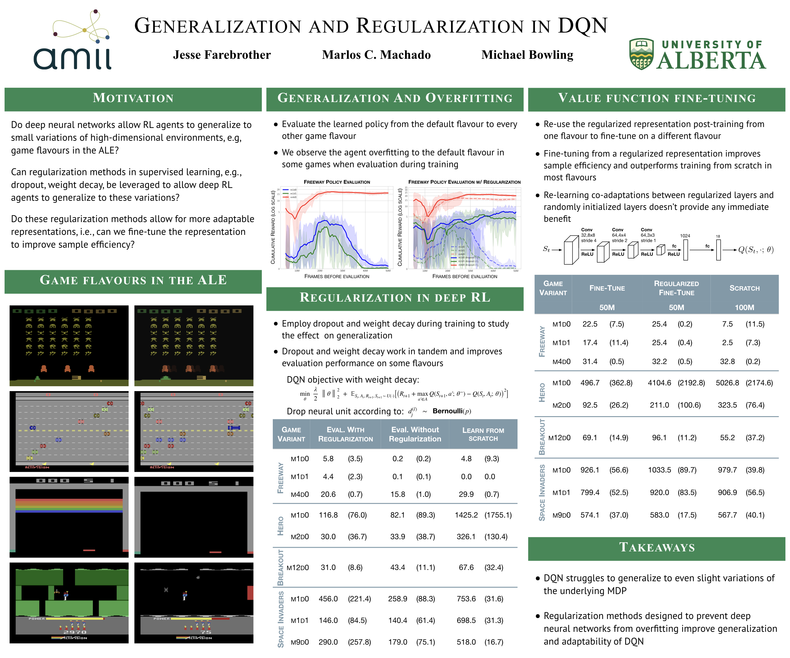

# Generalization and Regularization in DQN

*Code and LaTeX source for the paper _[Generalization and Regularization in DQN](https://arxiv.org/abs/1810.00123)_ .*



## Reproducing key results
The code used in all experiments can be located at [JesseFarebro/dqn-ale](https://github.com/JesseFarebro/dqn-ale). You can checkout the code by cloning this repository with recursive submodules and follow the instructions at the provided repository.

#### To run the baseline experiments simply run:
```sh
python3 main.py --rom {freeway.bin,hero.bin,space_invaders.bin,breakout.bin} \
                --random_seed {0,1,2,3,4,5,6,7,8,9}
```

#### To run baseline experiments to obtain a regularized representation run:
```sh
python3 main.py --rom {freeway.bin,hero.bin,space_invaders.bin,breakout.bin} \
                --random_seed {0,1,2,3,4,5,6,7,8,9} \
                --use_dropout \
                --use_l2
```

#### To evaluate learned policies from checkpoints run:
```sh
python3 main.py --rom {freeway.bin,hero.bin,space_invaders.bin,breakout.bin} \
                --random_seed {0,1,2,3,4,5,6,7,8,9} \
                --evaluate \
                --max_episode_count 100 \
                --restore_dir {logdir,logdir_with_reg}
```

#### To fine tune the entire network (representation + state value layers) on a new mode:
```sh
python3 main.py --rom {freeway.bin,hero.bin,space_invaders.bin,breakout.bin} \
                --random_seed {0,1,2,3,4,5,6,7,8,9} \
                --restore_dir {logdir,logdir_with_reg} \
                --mode M --difficulty D
```

#### To re-learn co-adaptations you could run:
```sh
python3 main.py --rom {freeway.bin,hero.bin,space_invaders.bin,breakout.bin} \
                --random_seed {0,1,2,3,4,5,6,7,8,9} \
                --restore_dir {logdir, logdir_with_reg} \
                --mode M --difficulty D \
                --load_scope q/conv/
```

#### To freeze certain layers while fine-tuning others run:
```sh
python3 main.py --rom {freeway.bin,hero.bin,space_invaders.bin,breakout.bin} \
                --random_seed {0,1,2,3,4,5,6,7,8,9} \
                --restore_dir {logdir, logdir_with_reg} \
                --mode M --difficulty D \
                --optimize_scope q/conv/
```

## Reference

```
@article{Farebrother2018a,
  author    = {Jesse Farebrother and
               Marlos C. Machado and
               Michael Bowling},
  title     = {Generalization and Regularization in {DQN}},
  journal   = {CoRR},
  volume    = {abs/1810.00123},
  year      = {2018},
}
```
